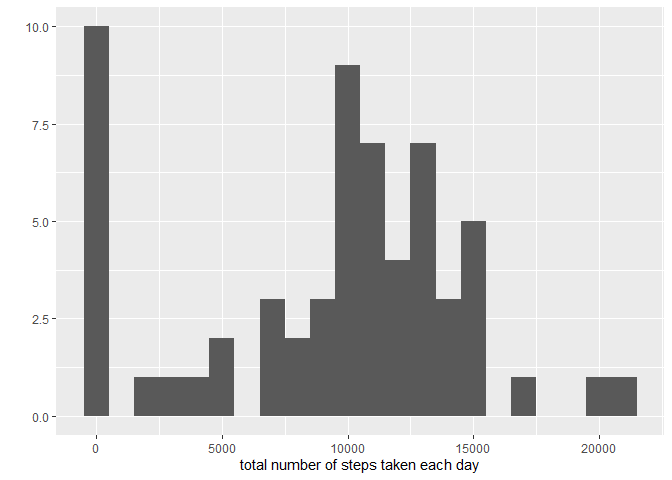

Introduction
------------

It is now possible to collect a large amount of data about personal
movement using activity monitoring devices such as a
[Fitbit](http://www.fitbit.com), [Nike
Fuelband](http://www.nike.com/us/en_us/c/nikeplus-fuelband), or [Jawbone
Up](https://jawbone.com/up). These type of devices are part of the
“quantified self” movement – a group of enthusiasts who take
measurements about themselves regularly to improve their health, to find
patterns in their behavior, or because they are tech geeks. But these
data remain under-utilized both because the raw data are hard to obtain
and there is a lack of statistical methods and software for processing
and interpreting the data.

This assignment makes use of data from a personal activity monitoring
device. This device collects data at 5 minute intervals through out the
day. The data consists of two months of data from an anonymous
individual collected during the months of October and November, 2012 and
include the number of steps taken in 5 minute intervals each day.

Data
----

The data for this assignment can be downloaded from the course web site:

-   Dataset: [Activity monitoring
    data](https://d396qusza40orc.cloudfront.net/repdata%2Fdata%2Factivity.zip)
    \[52K\]

The variables included in this dataset are:

-   **steps**: Number of steps taking in a 5-minute interval (missing
    values are coded as `NA`)

-   **date**: The date on which the measurement was taken in YYYY-MM-DD
    format

-   **interval**: Identifier for the 5-minute interval in which
    measurement was taken

The dataset is stored in a comma-separated-value (CSV) file and there
are a total of 17,568 observations in this dataset.

Assignment
----------

This assignment will be described in multiple parts. You will need to
write a report that answers the questions detailed below. Ultimately,
you will need to complete the entire assignment in a **single R
markdown** document that can be processed by **knitr** and be
transformed into an HTML file.

Throughout your report make sure you always include the code that you
used to generate the output you present. When writing code chunks in the
R markdown document, always use `echo = TRUE` so that someone else will
be able to read the code. **This assignment will be evaluated via peer
assessment so it is essential that your peer evaluators be able to
review the code for your analysis**.

For the plotting aspects of this assignment, feel free to use any
plotting system in R (i.e., base, lattice, ggplot2)

Fork/clone the [GitHub repository created for this
assignment](http://github.com/rdpeng/RepData_PeerAssessment1). You will
submit this assignment by pushing your completed files into your forked
repository on GitHub. The assignment submission will consist of the URL
to your GitHub repository and the SHA-1 commit ID for your repository
state.

NOTE: The GitHub repository also contains the dataset for the assignment
so you do not have to download the data separately.

### Loading and preprocessing the data

Show any code that is needed to

1.  Load the data (i.e. `read.csv()`)

2.  Process/transform the data (if necessary) into a format suitable for
    your analysis

<!-- -->

    unzip(zipfile="activity.zip")
    data <- read.csv("activity.csv")

### What is mean total number of steps taken per day?

    library(ggplot2)
    total.steps <- tapply(data$steps, data$date, FUN=sum, na.rm=TRUE)
    qplot(total.steps, binwidth=1000, xlab="total number of steps taken each day")

    mean(total.steps, na.rm=TRUE)

    ## [1] 9354.23

    median(total.steps, na.rm=TRUE)

    ## [1] 10395

### What is the average daily activity pattern?

    library(ggplot2)
    averages <- aggregate(x=list(steps=data$steps), by=list(interval=data$interval),
                          FUN=mean, na.rm=TRUE)
    ggplot(data=averages, aes(x=interval, y=steps)) +
        geom_line() +
        xlab("5-minute interval") +
        ylab("average number of steps taken")

On average across all the days in the dataset, the 5-minute interval
contains the maximum number of steps?

    averages[which.max(averages$steps),]

    ##     interval    steps
    ## 104      835 206.1698

### Imputing missing values

There are many days/intervals where there are missing values (coded as
`NA`). The presence of missing days may introduce bias into some
calculations or summaries of the data.

    missing <- is.na(data$steps)
    # How many missing
    table(missing)

    ## missing
    ## FALSE  TRUE 
    ## 15264  2304

All of the missing values are filled in with mean value for that
5-minute interval.

    # Replace each missing value with the mean value of its 5-minute interval
    fill.value <- function(steps, interval) {
        filled <- NA
        if (!is.na(steps))
            filled <- c(steps)
        else
            filled <- (averages[averages$interval==interval, "steps"])
        return(filled)
    }
    filled.data <- data
    filled.data$steps <- mapply(fill.value, filled.data$steps, filled.data$interval)

Now, using the filled data set, let’s make a histogram of the total
number of steps taken each day and calculate the mean and median total
number of steps.

    total.steps <- tapply(filled.data$steps, filled.data$date, FUN=sum)
    qplot(total.steps, binwidth=1000, xlab="total number of steps taken each day")

    mean(total.steps)

    ## [1] 10766.19

    median(total.steps)

    ## [1] 10766.19

Mean and median values are higher after imputing missing data. The
reason is that in the original data, there are some days with `steps`
values `NA` for any `interval`. The total number of steps taken in such
days are set to 0s by default. However, after replacing missing `steps`
values with the mean `steps` of associated `interval` value, these 0
values are removed from the histogram of total number of steps taken
each day.

### Are there differences in activity patterns between weekdays and weekends?

First, let’s find the day of the week for each measurement in the
dataset. In this part, we use the dataset with the filled-in values.

    # This set because my country is Costa Rica, and i need validate the weekday in english (for standards purposes) 
    Sys.setlocale("LC_TIME", "C")

    ## [1] "C"

    filled.data$date <- as.Date(strptime(filled.data$date, format="%Y-%m-%d"))

    filled.data$dayType <- sapply(filled.data$date, function(x) {
      if(weekdays(x) == "Saturday" | weekdays(x) == "Sunday")
      {y <- "Weekend"}
      else {y <- "Weekday"}
      y
    })

    # Creating the data set that will be plotted

    activityByDay <-  aggregate(steps ~ interval + dayType, filled.data, mean, na.rm = TRUE)

    # Plotting using ggplot2
    dayPlot <-  ggplot(activityByDay, aes(x = interval , y = steps, color = dayType)) + 
      geom_line() + 
      xlab("Interval") + 
      ylab("Average Number of Steps") +
      facet_wrap(~dayType, ncol = 1, nrow=2) +
      scale_color_discrete(name = "Day Type") 

    print(dayPlot) 

